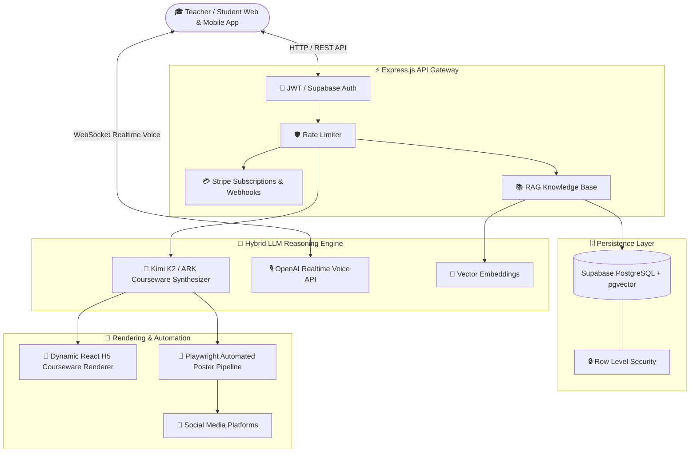

<div align="center">

```text
 ███████╗██████╗ ██╗███╗   ██╗███████╗███████╗████████╗
 ██╔════╝██╔══██╗██║████╗  ██║██╔════╝██╔════╝╚══██╔══╝
 █████╗  ██║  ██║██║██╔██╗ ██║█████╗  ███████╗   ██║   
 ██╔══╝  ██║  ██║██║██║╚██╗██║██╔══╝  ╚════██║   ██║   
 ███████╗██████╔╝██║██║ ╚████║███████╗███████║   ██║   
 ╚══════╝╚═════╝ ╚═╝╚═╝  ╚═══╝╚══════╝╚══════╝   ╚═╝   
```

# 🎓 eduNest — Next-Gen AI-Powered Interactive Education Monorepo Platform

<p align="center">
  <b>Industrial-grade AI interactive learning, dynamic courseware synthesis, and multi-platform publishing platform powered by Next.js 14, Express, Kimi K2 / OpenAI Realtime, & Supabase</b>
</p>

<p align="center">
  <a href="./README.md">🇺🇸 English</a> •
  <a href="./README_CN.md">🇨🇳 简体中文</a> •
  <a href="./doc/QUICK_START.md">⚡ Quick Start</a> •
  <a href="./doc/DEPLOYMENT_GUIDE.md">🚀 Deployment</a> •
  <a href="./CHANGELOG.md">📝 Changelog</a>
</p>

<p align="center">
  <a href="https://github.com/tubban1/eduNest/stargazers"></a>
  <a href="https://github.com/tubban1/eduNest/network/members"></a>
  <a href="https://github.com/tubban1/eduNest/releases"></a>
  <a href="https://opensource.org/licenses/MIT"></a>
  <a href="https://nodejs.org"></a>
  <a href="https://nextjs.org"></a>
  <a href="https://www.typescriptlang.org"></a>
  <a href="https://supabase.com"></a>
  <a href="https://www.docker.com"></a>
  <a href="https://github.com/tubban1/eduNest/pulls"></a>
</p>

<p align="center">
  <a href="https://vercel.com/new/clone?repository-url=https://github.com/tubban1/eduNest&root-directory=frontend"></a>
  <a href="https://railway.app/new/template?template=https://github.com/tubban1/eduNest"></a>
  <a href="https://zeabur.com/templates/NEW"></a>
  <a href="https://cloud.sealos.io"></a>
</p>

</div>

---

## 💡 What is eduNest?

**eduNest** is an open-source, production-ready full-stack AI interactive education and automated courseware generation platform. Built on a modern **Monorepo** architecture, it seamlessly connects a **Next.js 14 interactive web client**, an **Express.js API gateway**, a **Flutter mobile application**, and an automated **Playwright marketing pipeline**.

By leveraging advanced **Kimi K2 reasoning models** and **OpenAI Realtime low-latency bidirectional voice APIs**, eduNest transforms static textbooks and exam questions into **interactive H5 animations, dynamic quizzes, and real-time conversational AI tutors**.

---

## ⚡ Key Feature Highlights

<table width="100%">
<tr>
<td width="50%" valign="top">

### 🎨 1. AI Interactive Courseware & Simulation Engine
* **Dynamic H5 Simulations**: Interactive geometry, solar system orbits, and physics experiments.
* **Smart Adaptive Quizzes**: Multiple-choice, interactive fill-in-the-blank, drag-and-drop questions.
* **Exam Deduction & Knowledge Graph**: Built-in curriculum for Swiss Kanton Bern (BM/Gymnasium) entrance exams.

</td>
<td width="50%" valign="top">

### 🎙️ 2. Realtime Audio & RAG Knowledge Base
* **OpenAI Realtime Voice Tutor**: Sub-second low-latency conversational audio for spoken AI tutoring.
* **RAG Vector Search**: Accurate concept retrieval powered by `text-embedding-3-small` and Supabase pgvector.
* **Multi-LLM Provider Support**: Native integration with Volcengine ARK (Kimi K2), Moonshot AI, and OpenAI.

</td>
</tr>
<tr>
<td width="50%" valign="top">

### 💳 3. Commercial SaaS & Multi-Tenant Security
* **Stripe Paywall & Subscriptions**: Automatic webhook processing for Free & Pro tiers.
* **Supabase Row Level Security (RLS)**: Strict data isolation protecting student records and exams.
* **JWT & API Rate Limiting**: Production-grade authentication and DDoS/brute-force prevention.

</td>
<td width="50%" valign="top">

### 📱 4. Monorepo Cross-Platform & Social Pipeline
* **Modern Monorepo**: Shared packages, type definitions, and unified configs for Web & Flutter.
* **Automated Social Distribution**: Generates rich visual posters and automatically publishes to social channels via Playwright.
* **Internationalization (i18n)**: Out-of-the-box multi-language support (English / Chinese).

</td>
</tr>
</table>

---

## 🛠️ System Architecture



---

## 🚀 Quick Deployment

### Option 1: Docker Compose (Recommended)

Get everything up and running with a single command:

```bash
# 1. Clone the repository
git clone https://github.com/tubban1/eduNest.git
cd eduNest

# 2. Setup environment variables
cp env.example .env

# 3. Build and launch containers
docker compose up -d --build
```

Access points:
* 🌐 **Web Platform**: `http://localhost:3000`
* 🔌 **Backend API**: `http://localhost:3001/api`
* 🩺 **Health Check**: `http://localhost:3001/api/health`

---

### Option 2: Local Development

Requires Node.js >= 20.0.0 and npm >= 9.0.0:

```bash
# 1. Install dependencies
npm install

# 2. Setup environment
cp env.example .env

# 3. Start development servers
npm run dev
```

---

### Option 3: One-Click Deploy to Vercel

[](https://vercel.com/new/clone?repository-url=https://github.com/tubban1/eduNest&root-directory=frontend)

> 📖 For advanced deployment guides (Docker, PM2, BT-Panel, Railway), please check the [📖 Deployment Guide](./doc/DEPLOYMENT_GUIDE.md).

---

## ⚙️ Environment Variables

| Variable | Required | Default / Example | Description |
| :--- | :---: | :--- | :--- |
| `PORT` | No | `3001` | Backend listening port |
| `JWT_SECRET` | Yes | `your-secret-key` | JWT signature secret |
| `SUPABASE_URL` | Yes | `https://xxx.supabase.co` | Supabase project instance URL |
| `SUPABASE_SERVICE_KEY` | Yes | `eyJhbGciOi...` | Supabase Service Role Key |
| `SUPABASE_ANON_KEY` | Yes | `eyJhbGciOi...` | Supabase public Anon Key |
| `ARK_API_KEY` | Optional | `volc-api-key` | Volcengine ARK (Kimi K2) Key |
| `KIMI_API_KEY` | Optional | `sk-moonshot-key` | Moonshot AI Key |
| `DEFAULT_AI_PROVIDER` | No | `ark` | Default LLM Provider (`ark` / `kimi`) |
| `GPT_REALTIME_API_KEY` | Optional | `sk-openai-key` | OpenAI Realtime & Embedding Key |
| `STRIPE_SECRET_KEY` | Optional | `sk_test_xxx` | Stripe Secret Key |
| `STRIPE_WEBHOOK_SECRET`| Optional | `whsec_xxx` | Stripe Webhook signing secret |
| `NEXT_PUBLIC_API_BASE_URL` | Yes | `http://localhost:3001/api` | API Endpoint for Frontend |

---

## 📁 Repository Layout

```text
eduNest/
├── .github/                 # CI/CD workflows and standardized Issue/PR templates
├── backend/                 # Express.js backend API (JWT, Stripe, Realtime, Kimi K2)
│   ├── src/                 # Controllers, models, routes, services
│   └── Dockerfile           # Backend container build configuration
├── frontend/                # Next.js 14 frontend interactive application
│   ├── public/              # Swiss exam archives & visual assets
│   ├── src/                 # React 18 pages, components & Tailwind CSS
│   └── Dockerfile           # Frontend container build configuration
├── apps/                    # Mobile applications (apps/mobile-flutter)
├── packages/                # Monorepo shared modules
├── scripts/                 # Playwright automation & data scrapers
├── doc/                     # Architecture, PRD, and deployment guides
├── docker-compose.yml       # Production Docker Compose orchestration
├── env.example              # Environment variables template
├── LICENSE                  # MIT License
└── package.json             # Monorepo root configuration
```

---

## 🗺️ Roadmap

- [x] Full-stack Monorepo architecture based on Next.js 14 + Express + Supabase
- [x] Kimi K2 interactive H5 courseware and adaptive quiz generation engine
- [x] OpenAI Realtime voice conversational tutoring & RAG vector search
- [x] Stripe subscription paywall, webhooks, and Supabase RLS multi-tenant security
- [x] Playwright social media automated poster synthesis and publishing pipeline
- [x] One-click Docker Compose production deployment
- [ ] 🎨 **3D Virtual Lab Simulator** (Powered by Three.js / WebGL)
- [ ] 🤖 **Multi-Agent Collaborative AI Tutoring System**
- [ ] 🌍 **Expanded International Curricula & Standardized Exam Archives**

---

## 🤝 Contributing & Community

Contributions are what make the open-source community an amazing place to learn, inspire, and create:

1. Check out our [🤝 Contributing Guide](./CONTRIBUTING.md).
2. Share ideas and ask questions in [GitHub Discussions](https://github.com/tubban1/eduNest/discussions).
3. Follow the [Code of Conduct](./CODE_OF_CONDUCT.md).

<div align="center">

### 🌟 Star History

<a href="https://star-history.com/#tubban1/eduNest&Date">
 <picture>
   <source media="(prefers-color-scheme: dark)" srcset="https://api.star-history.com/svg?repos=tubban1/eduNest&type=Date&theme=dark" />
   <source media="(prefers-color-scheme: light)" srcset="https://api.star-history.com/svg?repos=tubban1/eduNest&type=Date" />
   
 </picture>
</a>

### 👥 Contributors

<a href="https://github.com/tubban1/eduNest/graphs/contributors">
  
</a>

</div>

---

## 📄 License

Distributed under the [MIT License](./LICENSE).

<div align="center">
  <sub>Crafted with ❤️ by the eduNest Team. Empowering every learner with personalized AI tutors and immersive interactive courseware.</sub>
</div>