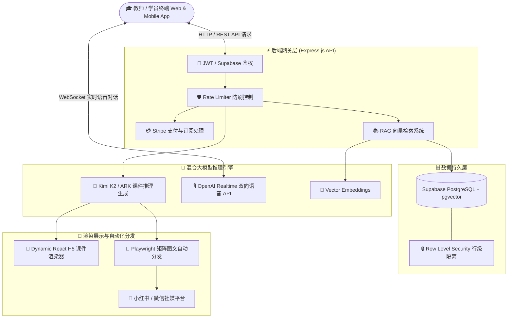

<div align="center">

```text
 ███████╗██████╗ ██╗███╗   ██╗███████╗███████╗████████╗
 ██╔════╝██╔══██╗██║████╗  ██║██╔════╝██╔════╝╚══██╔══╝
 █████╗  ██║  ██║██║██╔██╗ ██║█████╗  ███████╗   ██║   
 ██╔══╝  ██║  ██║██║██║╚██╗██║██╔══╝  ╚════██║   ██║   
 ███████╗██████╔╝██║██║ ╚████║███████╗███████║   ██║   
 ╚══════╝╚═════╝ ╚═╝╚═╝  ╚═══╝╚══════╝╚══════╝   ╚═╝   
```

# 🎓 eduNest — 新一代 AI 驱动的全场景互动教育与自动化生产 Monorepo 平台

<p align="center">
  <b>融合 Next.js 14、Express、Kimi K2 / OpenAI Realtime 语音大模型与 Supabase 的工业级 AI 互动教学、智能题库与多端矩阵系统</b>
</p>

<p align="center">
  <a href="./README_CN.md">🇨🇳 简体中文</a> •
  <a href="./README.md">🇺🇸 English</a> •
  <a href="./doc/QUICK_START.md">⚡ 快速上手</a> •
  <a href="./doc/DEPLOYMENT_GUIDE.md">🚀 部署指南</a> •
  <a href="./CHANGELOG.md">📝 更新日志</a>
</p>

<p align="center">
  <a href="https://github.com/tubban1/eduNest/stargazers"></a>
  <a href="https://github.com/tubban1/eduNest/network/members"></a>
  <a href="https://github.com/tubban1/eduNest/releases"></a>
  <a href="https://opensource.org/licenses/MIT"></a>
  <a href="https://nodejs.org"></a>
  <a href="https://nextjs.org"></a>
  <a href="https://www.typescriptlang.org"></a>
  <a href="https://supabase.com"></a>
  <a href="https://www.docker.com"></a>
  <a href="https://github.com/tubban1/eduNest/pulls"></a>
</p>

<p align="center">
  <a href="https://vercel.com/new/clone?repository-url=https://github.com/tubban1/eduNest&root-directory=frontend"></a>
  <a href="https://railway.app/new/template?template=https://github.com/tubban1/eduNest"></a>
  <a href="https://zeabur.com/templates/NEW"></a>
  <a href="https://cloud.sealos.io"></a>
</p>

</div>

---

## 💡 什么是 eduNest？

**eduNest** 是一套开箱即用、工业级标准的 **AI 互动教育与自动化课件生产全栈系统**。项目采用现代化 **Monorepo** 架构，无缝打通 **Next.js 14 前端交互平台**、**Express API 后端网关**、**Flutter 移动端** 以及 **Playwright 社媒营销自动化流水线**。

通过融合前沿的 **Kimi K2 复杂推理能力** 与 **OpenAI Realtime 双向低延迟语音模型**，eduNest 实现了将枯燥的传统考题与知识点一键转化为 **交互式 H5 动态课件、自适应测试题库与伴随式 AI 语音导师**，为 K12、高校以及国际升学考试（如瑞士 Kanton Bern 升学考）提供全流程 AI 教学解决方案。

---

## ⚡ 核心功能与特性矩阵

<table width="100%">
<tr>
<td width="50%" valign="top">

### 🎨 1. AI 互动课件与可视化仿真引擎
* **动态交互式 H5 课件**：支持动态几何交互、太阳系轨道模拟、物理力学实验等沉浸式可视化体验。
* **智能自适应出题**：支持单选、多选、填空、拖拽排序与图文解析等多种富文本交互题型。
* **分级推演与知识图谱**：内置针对瑞士 Kanton Bern (BM/Gymnasium) 数学与德语升学考题的完整推演库。

</td>
<td width="50%" valign="top">

### 🎙️ 2. Realtime 实时双向语音与 RAG 知识库
* **OpenAI Realtime 语音助教**：毫秒级超低延迟实时语音答疑，提供拟人化互动引导。
* **RAG 向量检索 (Vector Embedding)**：基于 `text-embedding-3-small` 精准检索题库知识点与教材。
* **多模型提供商灵活适配**：原生支持火山引擎 ARK (Kimi K2)、Moonshot AI 与 OpenAI 模型自由切换。

</td>
</tr>
<tr>
<td width="50%" valign="top">

### 💳 3. 商业级 SaaS 订阅与多租户权限
* **Stripe 订阅关卡闭环**：内置 Stripe Webhook 自动回调，支持 Free / Pro 会员等级与额度分配。
* **Supabase 行级安全 (RLS)**：严格的数据隔离策略，保障学员学习轨迹与私人试卷的绝对安全。
* **JWT & API 频率限制**：完善的身份鉴权机制与 Rate Limiter 接口防刷保护。

</td>
<td width="50%" valign="top">

### 📱 4. Monorepo 跨端与社媒矩阵 Pipeline
* **全栈 Monorepo 架构**：共享类型库与工具函数，无缝驱动 Web 平台与 Flutter 移动端 App。
* **Playwright 自动化营销**：全自动将生成的优质课件合成精美图文海报，一键无痕分发至小红书等社媒。
* **国际化 (i18n) 支持**：内置中/英等多语言动态切换与国际化路由。

</td>
</tr>
</table>

---

## 🛠️ 系统架构与数据流转 (Architecture)



---

## 🚀 极速部署 (Quick Deployment)

### 方式一：Docker Compose 一键部署（推荐）

仅需一条命令即可完成全栈服务的构建与启动：

```bash
# 1. 克隆仓库
git clone https://github.com/tubban1/eduNest.git
cd eduNest

# 2. 配置环境变量
cp env.example .env

# 3. 一键启动容器
docker compose up -d --build
```

启动完成后：
* 🌐 **前端控制台**：`http://localhost:3000`
* 🔌 **后端 API 网关**：`http://localhost:3001/api`
* 🩺 **健康检查接口**：`http://localhost:3001/api/health`

---

### 方式二：源码本地开发调试

确保本地已安装 Node.js >= 20.0.0 与 npm >= 9.0.0：

```bash
# 1. 安装 Monorepo 依赖
npm install

# 2. 复制并编辑环境变量
cp env.example .env

# 3. 启动全栈双端热重载开发
npm run dev
```

---

### 方式三：Vercel 一键云端部署

[](https://vercel.com/new/clone?repository-url=https://github.com/tubban1/eduNest&root-directory=frontend)

1. 点击上方按钮一键导入仓库。
2. 根目录选择 `frontend`。
3. 填入 `NEXT_PUBLIC_API_BASE_URL` 与 `NEXT_PUBLIC_SUPABASE_URL` 即可完成部署。

> 📖 **更多部署方式**（宝塔面板、PM2 原生部署、Railway 等）请参阅 [📖 完整部署指南文档](./doc/DEPLOYMENT_GUIDE.md)。

---

## ⚙️ 核心环境变量配置表 (Environment Variables)

| 配置分组 | 变量名 | 必填 | 默认 / 示例值 | 说明 |
| :--- | :--- | :---: | :--- | :--- |
| **基础配置** | `PORT` | 否 | `3001` | 后端服务监听端口 |
| | `NODE_ENV` | 否 | `development` / `production` | 运行环境模式 |
| | `JWT_SECRET` | 是 | `your-secret-key` | JWT 鉴权签名密钥 |
| **数据库** | `SUPABASE_URL` | 是 | `https://xxx.supabase.co` | Supabase 项目主实例地址 |
| | `SUPABASE_SERVICE_KEY` | 是 | `eyJhbGciOi...` | Supabase Service Role 高权密钥 |
| | `SUPABASE_ANON_KEY` | 是 | `eyJhbGciOi...` | Supabase 客户端公钥 |
| **AI 模型** | `ARK_API_KEY` | 选填 | `volc-api-key` | 火山引擎 ARK (Kimi K2) Key |
| | `KIMI_API_KEY` | 选填 | `sk-moonshot-key` | Moonshot AI API Key |
| | `DEFAULT_AI_PROVIDER` | 否 | `ark` | 默认生成大模型提供方 (`ark` / `kimi`) |
| **实时语音** | `GPT_REALTIME_API_KEY` | 选填 | `sk-openai-key` | Realtime 语音与 Embedding Key |
| | `GPT_REALTIME_WS_URL` | 选填 | `wss://tourmaster.ch/v1/realtime` | OpenAI Realtime WebSocket 地址 |
| **支付商业化** | `STRIPE_SECRET_KEY` | 选填 | `sk_test_xxx` | Stripe 服务端私钥 |
| | `STRIPE_WEBHOOK_SECRET`| 选填 | `whsec_xxx` | Stripe Webhook 签名验证密钥 |
| **前端参数** | `NEXT_PUBLIC_API_BASE_URL` | 是 | `http://localhost:3001/api` | 前端调用后端的 API 根路径 |

---

## 📁 目录组织架构 (Monorepo Layout)

```text
eduNest/
├── .github/                 # GitHub CI/CD 工作流与标准化 Issue/PR 模版
├── backend/                 # Express.js 后端服务 (JWT 鉴权, Stripe, Realtime, Kimi K2)
│   ├── src/                 # 后端业务核心代码 (controllers, models, routes, services)
│   └── Dockerfile           # 后端容器构建镜像配置
├── frontend/                # Next.js 14 前端交互平台 (课件渲染器、真题库、仪表盘)
│   ├── public/              # 瑞士真题图库与静态视觉资产
│   ├── src/                 # React 18 页面路由与 Tailwind 样式
│   └── Dockerfile           # 前端 Next.js 生产容器镜像配置
├── apps/                    # 移动端多端应用 (apps/mobile-flutter)
├── packages/                # Monorepo 跨端共享代码包
├── scripts/                 # Playwright 自动化发布与数据工具
├── doc/                     # 架构设计、部署指南与产品 PRD 文档库
├── docker-compose.yml       # 全栈生产级 Docker 编排配置
├── env.example              # 环境变量配置模板
├── LICENSE                  # MIT 开源协议
└── package.json             # Monorepo 全局依赖管理
```

---

## 🗺️ 路线图 (Roadmap)

- [x] 基于 Next.js 14 + Express + Supabase 的 Monorepo 全栈基础架构
- [x] Kimi K2 互动 H5 课件与动态试题生成引擎
- [x] OpenAI Realtime 双向语音交互与 RAG 向量知识库
- [x] Stripe 订阅计费、Webhook 回调与 Supabase RLS 多租户鉴权
- [x] Playwright 小红书课件营销矩阵自动化发布流水线
- [x] Docker Compose 一键化生产级部署体系
- [ ] 🎨 **3D 虚拟实验课件引擎**（基于 Three.js / WebGL 增强）
- [ ] 🤖 **Multi-Agent 多智能体协同学习答疑导师组**
- [ ] 🌍 **更多国际主流升学考试与知识体系内置支持**

---

## 🤝 贡献与社区 (Contributing & Community)

我们极其欢迎任何形式的贡献！无论是新特性建议、Bug 修复还是文档润色：

1. 查阅 [🤝 贡献指南 (CONTRIBUTING.md)](./CONTRIBUTING.md) 了解开发规范。
2. 在 [Discussions](https://github.com/tubban1/eduNest/discussions) 中畅所欲言，分享想法。
3. 遵守 [行为准则 (CODE_OF_CONDUCT.md)](./CODE_OF_CONDUCT.md)。

<div align="center">

### 🌟 Star 趋势 (Star History)

<a href="https://star-history.com/#tubban1/eduNest&Date">
 <picture>
   <source media="(prefers-color-scheme: dark)" srcset="https://api.star-history.com/svg?repos=tubban1/eduNest&type=Date&theme=dark" />
   <source media="(prefers-color-scheme: light)" srcset="https://api.star-history.com/svg?repos=tubban1/eduNest&type=Date" />
   
 </picture>
</a>

### 👥 贡献者荣誉墙 (Contributors)

<a href="https://github.com/tubban1/eduNest/graphs/contributors">
  
</a>

</div>

---

## 📄 开源协议 (License)

本项目基于 [MIT License](./LICENSE) 协议开源发布，允许商业使用、修改与衍生，但请保留原作者版权信息与开源声明。

<div align="center">
  <sub>eduNest 核心团队精心打造。让每一位学习者都能拥有个性化的 AI 专属导师与沉浸式互动课件。</sub>
</div>
