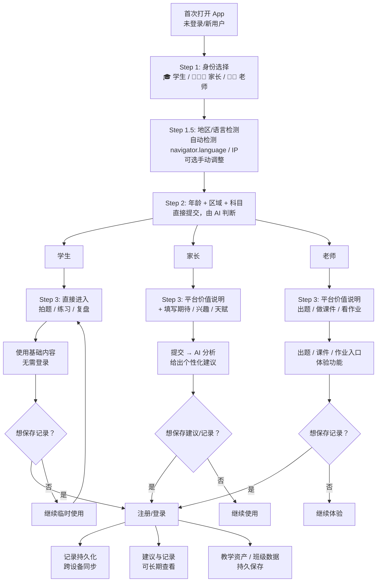

## Interactive Learning – 初始化阶段 UX 升级方案

本方案梳理的是 **首次进入产品时** 的整体用户体验，目标是让用户感受到：  
“这是一个懂我、会陪我、能让我变强的 AI 老师”，而不是一个冷冰冰的工具或题库 App。

---

### 1. 目标与设计原则

- **从情绪出发，而不是从功能出发**  
  首屏不是“拍题 / 做题 / 看课程”的功能菜单，而是学生/家长当下的状态与情绪。

- **先建立理解，再给方案**  
  用 3 分钟微诊断 + 学习画像，换取一次“被看见、被理解”的体验，而不是立刻推课程或题目。

- **一切行为都沉淀为“成长时间线”**  
  学习是动态的，UX 必须可视化时间与进步节点，让用户看到“自己在变强”。

- **AI 老师贯穿全程**  
  从文案到交互节奏，统一成“陪伴型 AI 老师”的世界观，而不是工具应用。

---

### 2. 用户与模式：学生 / 家长 / 老师（三类心理系统）

> **核心原则：角色判断 = 产品分叉点**  
> 如果不先分对象，后面所有陪伴感、学习路径、AI 策略都会打架。  
> 学生、家长、老师根本不是一个“用户类型”，他们是三个不同的“心理系统”。

#### 2.1 三类用户的真实核心需求

##### 👦 学生

**表面需求**：解题、提分

**真实需求**：
- 不被骂
- 有人陪
- 快速搞懂
- 不暴露自己“不会”

**他们怕的是**：
- 被评价
- 被说笨
- 被监控

**所以学生入口要**：轻、快、低压。

##### 👩 家长

**表面需求**：成绩提升

**真实需求**：
- 可控
- 可见
- 有进度
- 有回报感

**他们怕的是**：
- 孩子偷懒
- 钱白花
- 不知道孩子到底学了什么

**所以家长入口必须有**：“数据”和“结构”。

##### 👨‍🏫 老师

**表面需求**：教学工具

**真实需求**：
- 提高效率
- 减轻负担
- 有教学资产沉淀
- 专业感

**老师怕的是**：
- 花时间研究一个花哨工具
- 没法规模使用
- 不够严谨

**所以老师入口要强调**：
- 可批量
- 可布置
- 可统计
- 可复用

#### 2.2 首页第一步：身份选择（身份认同）

**不是“你几年级”，而是：**

> **你想以什么身份进入？**

**按钮式（不要下拉框，不要冷冰冰的选择器）**：
- 🎓 我是学生
- 👨‍👩‍👧 我是家长
- 👩‍🏫 我是老师

这是一次“身份认同”，不是功能选择。

#### 2.3 更成熟的结构：不超过 3 步（含地区检测）

用户第一次进入：

1. **Step 1：身份选择**（🎓 学生 / 👨‍👩‍👧 家长 / 👩‍🏫 老师）
2. **Step 1.5：地区/语言检测**（自动检测 + 可选手动调整）
3. **Step 2：年龄 + 区域 + 科目**（直接提交，由 AI 判断使用，不做年级推断）
4. **Step 3：按身份进入**
   - 学生：直接进入拍题 / 练习 / 复盘  
   - 家长：平台价值说明 → 填写期待/兴趣/天赋 → AI 分析给出建议  
   - 老师：平台对老师的价值（出题、做课件、看作业）→ 对应功能  

> **原则：核心步骤不超过 3 步（身份 → 年龄+区域+科目 → 进入）。地区检测可做成轻量自动检测，不占用用户认知。**

#### 2.4 允许“临时进入”（注册时机优化）

**更聪明的做法**：

允许用户“临时进入”。

例如学生点进去：
- 直接拍题开始
- 等完成 **3 次互动** 后：
  - 系统再弹：“想保存学习记录吗？创建账户。”

这时候转化率会高很多。

---

### 3. 选择身份后的第二步：地区/语言检测 + 年龄 + 区域 + 科目

> **说明**：目前产品不区分账号类型，同一套流程下通过「身份」决定看到的内容和入口，**想保存记录时才需要注册/登录**。

#### 3.0 国际化处理：地区/语言检测 + 年龄+区域+科目（直接提交 AI）

**背景**：若按年级收集，年级在不同地区/语言下表述不同（初一 / Grade 7 / Year 7…）。改为年龄+区域后：
- 🇨🇳 中国：小学 / 初中 / 高中（初一/初二/初三，高一/高二/高三）
- 🇺🇸 美国：K-12（Kindergarten, Grade 1-12）
- 🇬🇧 英国：Year 1-13（Reception, Year 1-12, Sixth Form）
- 🇩🇪 德国：Klasse 1-13（Grundschule, Gymnasium）
- 🇫🇷 法国：CP-CM2, 6ème-3ème, 2nde-Terminale

**方案对比：年龄+区域 vs 年级+区域**

| 维度 | 年级 + 区域 | 年龄 + 区域 |
|------|-------------|-------------|
| **前端复杂度** | 需按地区维护多套年级文案（初一/Grade 7/Year 7…） | 统一：一个年龄选择器（或出生年）+ 区域，无需多套年级标签 |
| **内容匹配精度** | 用户明确选年级，**精度最高** | 年龄+区域交给 **AI 判断**，由 AI 结合语境给出建议 |
| **国际化一致性** | 输入因地区而异 | 输入全球一致（年龄数字 + 区域码） |
| **用户认知** | 用户习惯“几年级” | 用户也习惯“几岁”，尤其家长替孩子选时 |

**结论：年龄 + 区域直接提交给 AI，由 AI 判断使用，无需在前端或后端做年级推断。**

**推荐方案：年龄 + 区域 + 科目，直接提交 AI**

1. **Step 1.5：地区/语言检测（自动 + 手动）**
   - 自动检测：`navigator.language` / IP 地理位置（可选）
   - 手动选择：如自动检测不准，允许用户选择「地区/语言」
   - 存储：`region`（如 `CN`, `US`, `GB`）和 `language`（如 `zh-CN`, `en-US`）

2. **Step 2：年龄 + 区域 + 科目（直接提交，不做年级推断）**
   - **年龄**：单选或输入（如 6–18 岁，或出生年份）。**全球统一，无需按地区换文案。**
   - **区域**：已由 Step 1.5 得到。
   - **科目**：多选，按系统四种语言的 i18n 显示，不映射，提交时原样传给 AI。
   - **提交**：将 **年龄、区域、科目**（及身份、语言等）**直接提交给 AI**；由 **AI 结合年龄与区域自行判断** 如何使用（如对应什么学段、难度、推荐内容等），**不在产品内做年级推断或年级校对**。

3. **后端/AI 侧**
   - 前端提交：`{ region: 'CN', age: 12, subjects: ['数学', '物理'], ... }`
   - 不做 (age, region) → grade_level 的查表或映射；**将 age、region 原样传给 AI**，由 AI 在对话/推荐/分析时自行使用。
   - 科目**不做映射**，按系统支持的语言（如四种语言）做 i18n 展示即可，提交时原样传给 AI。

学生选的是「我的年龄、区域和科目」；家长选的是「孩子的年龄、区域和科目」；老师选的是「教学的年龄、区域和科目」；**均直接提交给 AI，由 AI 判断使用**。  
选完后，按身份进入不同的**基础内容与价值呈现**。

#### 3.1 学生：直接进入拍题 / 练习 / 复盘

- 不做额外「价值介绍」页，选完年龄、区域和科目后**直接进入**：
  - **拍题**：有不会的题，拍照/上传即用
  - **练习**：按年龄+区域+科目（由 AI 判断）推荐练习
  - **复盘**：做完题后的错题与思路回顾
- 全程可**临时使用**，无需登录；想保存记录时再提示注册/登录。

#### 3.2 家长：填写期待 + 孩子兴趣与天赋 → AI 分析建议

- **当前无「绑定孩子」功能**。家长路径为：在选完「孩子的年龄、区域和科目」后，**填写三类信息**，由 AI 分析后给出建议。
- **家长需提供**：
  1. **自己的期待**：希望孩子在学业/习惯/能力上达到什么（如“希望数学稳在班级前几”“希望养成先复习再做题的习惯”）
  2. **孩子的兴趣**：孩子喜欢什么、对什么有热情（学科、活动、方向等）
  3. **孩子的 talent**：孩子目前表现出的特长或优势（如逻辑强、表达好、动手能力强等）
- **产品行为**：将上述信息（结合已选年龄、区域、科目）提交给 AI，**AI 分析后给出个性化建议**（如学习重点、节奏、可尝试的方向、与期待/兴趣/天赋匹配的练习建议等）。
- 可先给一屏简短价值说明（平台如何用 AI 帮家长理清方向、给出建议），再进入「填写期待 / 兴趣 / 天赋」的表单或对话式收集。
- 想**保存本次分析建议或记录**时，再引导注册/登录。

#### 3.3 老师：传递平台对老师的价值 + 示例

- 选完「教学的年龄、区域和科目」后，**先给一屏价值说明**，并给出**具体能力**，例如：
  - **出题**：帮助老师出题、组卷
  - **做课件**：生成课件、互动内容
  - **看作业**：布置作业、查看完成情况与学情
- 再提供入口进入对应功能（出题 / 课件 / 作业）。
- 想保存教学资产、班级数据时，再引导注册/登录。

---

### 4. 首次流程总览（初始化路径）+ 注册/登录时机

#### 4.1 新用户 UX 路线图（概览）



#### 4.2 注册 / 登录时机（不区分账号功能）

**当前设计**：产品**不按身份区分账号类型**，注册/登录的唯一触发是——**想保存记录**。

- **学生**：拍题、练习、复盘都可临时使用；当用户想「保存学习记录、下次接着用」时，再提示注册/登录。
- **家长**：可先填写期待/兴趣/天赋并获取 AI 建议；当想「保存分析建议或记录」时，再提示注册/登录。
- **老师**：可先试用出题、课件、看作业；当想「保存教学资产、班级数据」时，再提示注册/登录。

统一话术可沿用：**「想保存记录吗？注册/登录后可在多设备查看、长期使用。」**

#### 4.3 文字版流程拆解（含国际化）

1. **Step 1：身份选择**  
   🎓 我是学生 / 👨‍👩‍👧 我是家长 / 👩‍🏫 我是老师

2. **Step 1.5：地区/语言检测（轻量，不占用用户认知）**  
   - **自动检测**：`navigator.language`（如 `zh-CN`, `en-US`, `de-DE`）  
   - **可选 IP 地理位置**：辅助判断地区（如 `CN`, `US`, `GB`）  
   - **手动调整**：如果自动检测不准，提供“切换地区/语言”入口（小字，不强制）  
   - **存储**：`region` + `language`，用于提交与科目名称展示

3. **Step 2：年龄 + 区域 + 科目（直接提交 AI）**  
   - **年龄**：单选或输入（如 6–18 岁，或出生年份），**全球统一**  
   - **区域**：已由 Step 1.5 得到  
   - **科目**：多选，按系统四种语言的 i18n 显示，不映射，提交时原样传给 AI。  
   - **提交**：年龄、区域、科目等**直接提交给 AI**，由 **AI 判断** 如何使用，产品内**不做年级推断**

4. **Step 3：按身份输出基础内容**  
   - **学生**：直接进入拍题 / 练习 / 复盘（无额外价值页）  
   - **家长**：先看平台价值说明，再填写自己的期待、孩子的兴趣与天赋，提交后由 AI 分析并给出建议  
   - **老师**：先看平台对老师的价值（出题、做课件、看作业），再进入对应功能  

5. **想保存记录时**  
   提示注册/登录；不区分账号角色，仅用于「保存记录、跨设备、长期使用」。

#### 4.4 实施路径建议（国际化）

**前端实现**：

1. **地区/语言检测模块**：
   ```javascript
   // 自动检测
   const detectedLanguage = navigator.language || 'en-US';
   const detectedRegion = getRegionFromLanguage(detectedLanguage); // zh-CN → CN
   
   // 可选：IP 地理位置（需要第三方服务）
   // const ipRegion = await fetchIPRegion();
   
   // 存储到 localStorage / state
   const region = userSelectedRegion || detectedRegion;
   const language = userSelectedLanguage || detectedLanguage;
   ```

2. **不做年级推断**：不维护 (age, region) → grade_level 映射表；**年龄、区域与科目直接提交给 AI**，由 AI 在分析/推荐时自行判断使用。

3. **科目（不映射，仅 i18n）**：
   - 科目**不需要映射**到标准码，只要在系统支持的**四种语言**下有一致展示即可
   - 使用现有 i18n 系统（如 `i18next`），科目列表按 `language` 显示对应文案，提交时原样传给 AI

**后端实现**：

1. **直接提交，不做年级映射**：
   - 前端提交：`{ region: 'CN', age: 12, subjects: ['数学', '物理'], ... }`
   - **年龄、区域原样传给 AI**，由 AI 判断使用；不在后端做 (age, region) → grade_level 推断。
   - 科目**不做映射**，只要在系统支持的语言（如四种语言）下有一致展示，提交时原样传给 AI。

**优先级**：
- **Phase 1**：先支持中国（CN）+ 英语地区（US/GB），验证流程
- **Phase 2**：扩展更多地区（DE, FR, JP 等）
- **Phase 3**：优化自动检测准确率，加入 IP 地理位置辅助

---

### 5. 国际化实施路径详解

#### 5.0 年龄+区域 vs 年级+区域：为什么推荐年龄+区域？

**年龄+区域的优势**：
- ✅ **全球统一输入**：一个年龄数字（或出生年）+ 区域，前端无需为每个地区维护多套年级文案（初一/Grade 7/Year 7…）
- ✅ **直接交给 AI**：年龄、区域与科目直接提交给 AI，由 **AI 判断** 学段、难度、推荐等，产品内**不做年级推断**，实现更简单
- ✅ **实现与扩展简单**：无需维护 (age, region) → grade 映射表，新增地区也不必改前端
- ✅ **家长替孩子选时**：年龄往往比“几年级”更直观（“孩子 12 岁”比“孩子初一”更常被说）

**结论**：**年龄 + 区域 + 科目直接提交给 AI**，由 AI 自行判断使用，无需在产品内做年级推断或年级校对。

**若做年级映射的代价**：  
年级映射必然涉及**不同国家、区域和教育体系**（中国 K12、美国 K-12、英国 Year 1–13、各国学制起止年龄不一）。一旦做映射表，就要持续维护、逐地区校验；**覆盖不到的区域**（小国、特殊学制、跨境家庭）会直接暴露为“选不到合适年级”或映射错误，体验差且难以兜底。把年龄和区域直接交给 AI，由 AI 根据语境判断，可避免这套映射的维护成本和覆盖缺口问题。

#### 5.1 地区/语言检测策略

**自动检测（优先）**：
1. **`navigator.language`**：浏览器语言设置
   - `zh-CN` → 中国（简体中文）
   - `en-US` → 美国（英语）
   - `en-GB` → 英国（英语）
   - `de-DE` → 德国（德语）
   - `fr-FR` → 法国（法语）
   - 等等...

2. **IP 地理位置（可选，需要第三方服务）**：
   - 使用服务如 `ipapi.co`, `ip-api.com` 等
   - 辅助判断地区，但可能不准确（VPN、代理等）

**手动调整（兜底）**：
- 在页面底部或设置中提供“切换地区/语言”入口
- 小字提示，不强制用户操作
- 用户选择后覆盖自动检测结果

**存储**：
- `region`：地区码（`CN`, `US`, `GB`, `DE`, `FR` 等）
- `language`：语言码（`zh-CN`, `en-US`, `de-DE` 等）
- 存储到 `localStorage` 或用户账号（如果已登录）

#### 5.2 不做年级推断：年龄与区域直接提交 AI

产品内**不维护 (age, region) → grade 映射表**，也不提供年级校对。  
原因之一：年级映射依赖**多国/多教育体系**的准确数据，**未覆盖或难覆盖的区域**（小国、特殊学制、跨境等）会带来“选不到年级”或映射错误，维护成本高、体验难兜底。  
前端收集 **年龄、区域、科目**（及身份、语言等）后，**原样提交给 AI**；由 **AI 在分析、推荐、出题等环节自行判断** 如何结合年龄与区域使用（学段、难度、表述等）。  
若后续有统计或检索需要标准年级码，可在 **AI 侧或数据层** 由 AI 输出/写入，而不在产品初始化流程中做推断。

#### 5.3 科目：不映射，符合系统四种语言即可

**科目不需要做映射**。只需在系统支持的**四种语言**下有一致的展示（如 zh-CN / en-US / fr-FR / de-DE），用现有 i18n 按 `language` 显示科目名称即可；用户选择的科目**原样提交给 AI**，不做标准码转换。

```json
// 示例：四种语言下的科目文案（key 可统一，如 math / physics，展示用 i18n）
// zh-CN: 数学、物理  |  en-US: Math, Physics  |  fr-FR: Mathématiques, Physique  |  de-DE: Mathematik, Physik
```

#### 5.4 后端 / 提交

**前端提交**（年龄、区域、科目均不映射，直接提交）：
```json
{
  "region": "CN",
  "language": "zh-CN",
  "age": 12,
  "subjects": ["数学", "物理"]
}
```

**后端 / AI 侧**：
- **年龄、区域、科目**均**原样传给 AI**，由 AI 判断使用。
- 不做 (age, region) → grade_level 映射，**也不做科目 → 标准码映射**；只要前端科目在系统四种语言下有一致 i18n 即可。

#### 5.5 实施优先级

**Phase 1（MVP）**：
- 支持中国（CN）+ 英语地区（US/GB）
- 自动检测 `navigator.language`
- 年龄、区域、科目直接提交 AI，不做年级映射
- 验证流程与用户体验

**Phase 2（扩展）**：
- 扩展更多地区（DE, FR, JP, KR 等）
- 加入 IP 地理位置辅助检测（可选）

**Phase 3（优化）**：
- 优化自动检测准确率
- 用户手动调整历史记录（记住用户偏好）

---

### 6. 关键模块拆解

#### 6.1 成长时间线（学习轨迹）

学习是动态过程，UX 需要一个 **“学习轨迹”** 概念：

- 不是简单的“成绩折线图”，而是：
  - **时间轴 + 关键突破点**

示例节点：
- 3 月 12 日：第一次掌握因式分解  
- 3 月 20 日：指数错误率下降到 20%  
- 4 月 1 日：首次独立完成综合题  

这是一种 **成就感设计**：  
让学生看到“自己正在积累一条成长时间线”，而不是一次次孤立的刷题记录。

所有行为（拍题、完成一套练习、攻克一个知识点、完成一次复盘）都可以落在时间轴上，成为成长故事的一部分。

#### 6.2 互动学习空间 vs 课程列表

进入主界面后，不再是“课表式”的课程列表，而是：

- **能力地图 + 场景入口**

例如针对“指数”：
- 结构理解：70%  
- 运算稳定性：40%  
- 步骤规划能力：30%  

学生点击某一维度，就进入对应的互动练习与讲解。  
传统的“选年级 → 选科目 → 选课程”仅作为辅助入口，而不是主路径。

拍题入口（“我现在就有不会的题”）应该：
- **永远存在于顶部**，像一个“紧急按钮”，随时可用。

#### 6.3 拍题流程与元认知提问

推荐流程：

1. 用户在首页选择：“😰 我有不会的题”
2. 页面不要立刻跳到拍照界面，而是先给一句语境文案：
   - **“我陪你一起拆这道题。”**
3. 然后再进入拍题/上传页面。

拍题后流程：
- 上传 → AI 识别 → **不立即讲解**，而是先问：

> “这道题你卡在哪一步？”

选项示例：
- 看不懂题目  
- 不知道从哪开始  
- 算到一半卡住  
- 全部都不会  

这一步得到的是 **元认知信息**，可以写入画像与时间线，为后续“教学人格参数”与能力地图提供信号。

#### 6.4 能力地图（非课表）

用“能力地图”替代“课表式导航”：

- 维度可以是：结构理解 / 运算稳定性 / 步骤规划能力 / 迁移应用 / 反思复盘等。  
- 每次练习、讲解、错题纠偏都会微调这些维度的估计值。  
- 地图以可视方式呈现当前能力分布，帮助学生理解“自己强在哪、弱在哪”。

---

### 7. 教学人格参数（Age → Persona）

年龄本身不是最终标签，更重要的是它对以下五个维度的影响：

- **语言风格**：是否更童趣、更口语化，还是更严谨、学术化  
- **引导强度**：步骤要不要拆得特别细、要不要频繁 checkpoint  
- **可视化复杂度**：图示与动态表现的复杂度  
- **学习节奏**：一次交给多少信息、多长时间推动一步  
- **鼓励方式**：表扬语气、对失败的回应方式

因此，我们真正需要的是一组 **“教学人格参数”**，而不是一个裸的“年龄数字”：

- 通过“动机 + 阶段 + 元认知回答”推断教学人格参数  
- 不同人格参数，驱动不同的：
  - 对话语气  
  - 引导节奏  
  - 反馈方式  
  - 可视化密度

---

### 8. 不同用户模式下的 UX 差异

#### 8.1 学生模式

**真实需求**：不被骂、有人陪、快速搞懂、不暴露“不会”

**UX 特点**：
- 入口要**轻、快、低压**：情绪入口（不会的题 / 成绩不稳 / 想变强）
- 强调 AI 老师的**陪伴语境**与解题过程可视化
- 成长时间线更偏**“成就感 + 故事感”**，避免“被评价”的压迫感
- 允许临时进入，完成 3 次互动后再提示注册
- 避免“被监控”的感知：不强调“学习时长统计”，而是“突破点记录”

#### 8.2 家长模式

**真实需求**：可控、可见、有进度、有回报感

**当前能力（无绑定孩子）**：  
家长通过**填写自己的期待、孩子的兴趣、孩子的 talent**，由 **AI 分析后给出个性化建议**（学习重点、节奏、方向、与期待/兴趣/天赋匹配的练习建议等）。想保存建议或记录时再引导注册/登录。

**UX 特点（含未来扩展）**：
- 入口必须有**“数据”和“结构”**：关注点入口（成绩趋势 / 学习投入 / 弱项分布）
- 当前入口：**期待 + 兴趣 + 天赋** 的表单或对话式收集 → AI 建议
- Dashboard 式首页（若后续有数据）：趋势图 + 关键提醒 + 建议
- 成长时间线更偏**“阶段性成果 + 风险提示”**
- 提供可打印/导出的简版报告（如 AI 建议报告）
- 强调“可见性”：孩子学了什么、花了多少时间、哪里进步了（依赖后续绑定/数据能力）

#### 8.3 老师模式

**真实需求**：提高效率、减轻负担、有教学资产沉淀、专业感

**UX 特点**：
- 入口强调**工具属性**：批量生成 / 布置作业 / 查看数据
- 强调**可批量、可布置、可统计、可复用**
- 避免“花哨工具”的感知：界面简洁、功能明确
- 提供教学资产库：生成的内容可保存、可复用、可分享
- 数据统计要专业：班级整体数据、个体对比、知识点掌握度分布

---

### 9. 总结：初始化 UX 升级的关键要点

- **身份选择是产品分叉点**：  
  第一步必须是身份选择（学生 / 家长 / 老师），这是三个不同的“心理系统”，不能混在一起。

- **地区/语言检测（轻量自动）**：  
  在身份选择后，自动检测 `navigator.language` / IP 地理位置，用于区域、语言及科目名称展示与提交。允许手动调整，但不强制用户操作。

- **第二步统一：年龄 + 区域 + 科目（直接提交 AI）**：  
  - 年龄单选或输入（全球统一），区域由 Step 1.5 得到，科目多选；**不做年级推断**  
   - 科目按系统四种语言做 i18n 展示，不映射；提交时原样传给 AI
  - 学生选“我的”，家长选“孩子的”，老师选“教学的”  
  - **年龄、区域直接提交给 AI**，由 AI 判断使用，产品内不维护年级映射

- **第三步按身份输出基础内容**：  
  - **学生**：直接进入拍题 / 练习 / 复盘，无额外价值页  
  - **家长**：传递平台价值说明后，填写期待 + 孩子兴趣 + 孩子天赋，AI 分析后给出建议（当前无绑定孩子功能）  
  - **老师**：传递平台对老师的价值（出题、做课件、看作业），再给对应功能入口  

- **不超过 3 步（核心步骤）**：  
  Step 1 身份 → Step 1.5 地区检测（轻量）→ Step 2 年龄+区域+科目（直接提交 AI）→ Step 3 进入。地区检测不占用用户认知，核心步骤仍为 3 步。

- **目前不区分账号功能**：  
  注册/登录仅在「想保存记录」时触发，不按身份区分账号类型；统一话术即可。

- **直接提交 AI，不做年级推断**：  
  前端提交 `region`、`age`、科目等，**原样传给 AI**，由 AI 判断使用；产品内不做 (age, region) → grade_level 推断，**科目也不做映射**，只要符合系统四种语言的 i18n 即可。

- **AI 老师人格贯穿始终**：  
  收敛产品世界观，让用户感受到“这是一个在长期了解我、陪我变强的老师”，而不是一个一次性工具。 
加入“成长时间线”

你之前提到学习是动态的。

那 UX 必须可视化时间。

建议增加：

“学习轨迹”

不是成绩折线图。

而是：

时间轴 + 关键突破点

例如：

3月12日：第一次掌握因式分解
3月20日：指数错误率下降到20%
4月1日：首次独立完成综合题

这是成就感设计。


UX必须统一世界观。


首页：

“你今天的学习状态？”

↓

进入后：

系统做一个 3分钟微诊断

↓

生成：

你的学习画像 + 当前建议

↓

进入：

互动学习空间（非课程列表）

↓

拍题入口永远存在于顶部（紧急按钮）

↓

所有行为进入时间线

↓

AI老师贯穿全程


选年级 → 选科目 → 推荐内容

这太像课表。

更好的方式是：

生成一个“能力地图”。

比如：

你做了3道指数题，
系统生成：

你目前指数能力处于：

结构理解：70%
运算稳定性：40%
步骤规划能力：30%


流程应该是：

上传 → AI识别 → 不立即讲解

而是先问：

这道题你卡在哪一步？

给选项：

看不懂题目

不知道从哪开始

算到一半卡住

全部都不会

你得到的是元认知信息。


假设用户点：

“我有不会的题”

页面不要马上跳拍照界面。

先一句话：

我陪你一起拆这道题。

然后再进入拍题。

这种语境很重要。

你现在产品太像工具，不像陪伴系统。


现在大多数教育产品首页都犯一个错：

让用户做选择。

选择年级。
选择科目。
选择路径。

这太理性了。

真实用户刚进来时的状态是模糊的。

所以我建议：

首页不要问“你想做什么”。

而是问：

你现在的状态更像哪一种？

给三个情绪入口：

① 😰 我有不会的题
② 📉 最近成绩不太稳定
③ 🚀 想系统变强

这和“拍题/学习路径”完全不同。

这是从情绪进入。

情绪决定行为。


隐性年龄判断（更高级）

不要直接问年龄。

先问一个轻松问题：

你现在是为了什么学习？

📚 日常作业

📝 准备考试

🎓 升学冲刺

🧠 自我提升

然后第二步：

你现在大概在什么阶段？

小学

初中

高中

大学

成人学习

这比问“年龄”自然得多。

而且阶段比年龄更重要。

你真正需要的是：

认知水平

学习压力类型

目标导向


如果你未来要做大规模：

学生模式

家长模式

那第一次进入时可以问：

你是为自己学习，还是为孩子？

这一步非常重要。

因为：

家长关心的是：

成绩趋势

学习时间

报告

学生关心的是：

不会的题

快速搞懂

被理解

UX完全不同。


年龄会影响什么？

我们必须明确：

年龄不是标签，
而是影响下面五个维度：

语言风格（是否童趣）

引导强度（是否更结构化）

可视化复杂度

学习节奏

鼓励方式

所以你真正需要的是：

“教学人格参数”

而不是单纯一个数字。