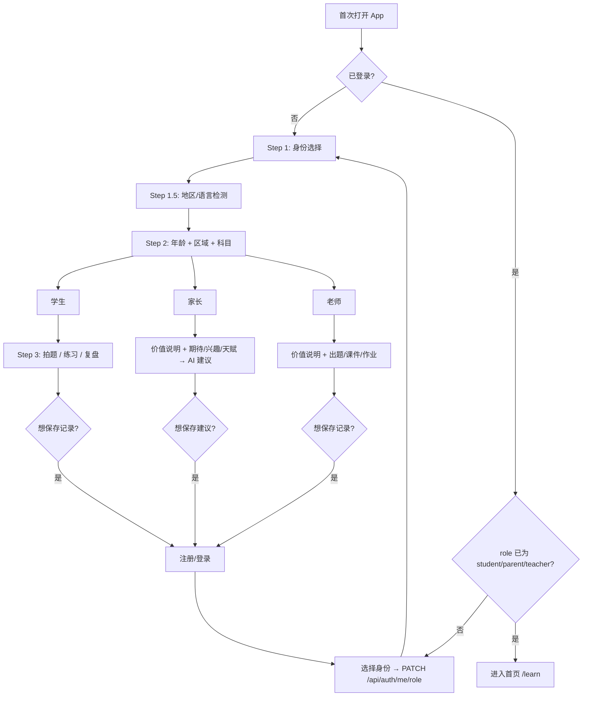

# PRD：互动学习初始化与身份化体验

> 基于 `Interactive_Learning_Enhance.md` 的产品需求文档，定义新用户/老用户的初始化流程、身份选择、年龄+区域+科目收集、家长/老师路径，以及 AI 学习工作台（/learn）的 MVP 形态。  
> 目标：**身份即产品分叉**，有针对性地提供内容与入口，在「想保存记录」时再引导注册/登录。

---

## 1. 文档状态与参考

- **主参考**：`Interactive_Learning_Enhance.md`（UX 原则、三类用户心理、流程总览、国际化）
- **数据结构**：`DataStructure.md`（现有表与新增表）
- **沉浸式学习 UX**：`Immersive_Learning_UX.md`（学习场景下的沉浸设计）

---

## 2. 目标与原则

- **身份选择 = 产品分叉点**：第一步为「🎓 学生 / 👨‍👩‍👧 家长 / 👩‍🏫 老师」，后续内容与入口按身份剪裁。
- **年龄 + 区域 + 科目，直接提交 AI**：产品内不做年级推断或年级校对，由 AI 判断使用。
- **科目不映射**：仅按系统四种语言（zh-CN / en-US / fr-FR / de-DE）i18n 展示，提交时原样传给 AI。
- **注册时机**：想保存记录（学习记录、家长建议、教学资产）时再引导注册/登录；不按身份区分账号类型。
- **老用户角色过渡**：已有账号且 `users.role` 为 `user` 或空时，登录后先选身份并更新 `users.role`，再进入主流程。

---

## 3. 功能需求概览

| 编号 | 需求 | 说明 |
|------|------|------|
| FR-1 | 身份选择 | 首次进入或未初始化时，Step 1：🎓 学生 / 👨‍👩‍👧 家长 / 👩‍🏫 老师；结果写入 `init_context`（localStorage 或后端）。 |
| FR-2 | 地区/语言检测（自动识别区域） | Step 1.5：**自动识别** `navigator.language` 及可选 IP 地域，得到 `region`、`language`；可选手动调整后进入 Step 2。 |
| FR-3 | 年龄/年龄段 + 区域 + 科目 | Step 2：**年龄/年龄段**（学生/家长填本人或孩子年龄如 6–18；**老师选教学对象年龄段**，如小学低段、小学高段、初中、高中）、**区域**（Step 1.5 结果）、**感兴趣/教授的科目**多选（i18n 展示）；直接提交给 AI，不做年级推断。 |
| FR-4 | 按身份进入 | 学生→拍题/练习/复盘；家长→价值说明 + 期待/兴趣/天赋 → AI 建议；老师→价值说明 + 出题/课件/作业入口。 |
| FR-4.1 | 家长未绑定孩子前的试用与探索 | **最初需求**：家长在绑定孩子账号之前，可能只想「试一下」「用示例分析一下孩子」「了解平台能给孩子学习带来什么价值」。这些意图需纳入**意图分析**与**路径规划**：不强制先绑定孩子，而是提供价值说明、示例/演示分析、基于 init_context 的体验建议等路径。 |
| FR-5 | 注册时机 | 不区分账号类型；仅在「想保存记录」时引导注册/登录。 |
| FR-6 | 登录后角色选择 | 若 `user.role` 为 `user` 或空，登录后先进入「选择身份」页/弹层，调 `PATCH /api/auth/me/role` 更新 `users.role`，再进首页或 /learn。 |

---

## 4. 新用户流程（简要）

1. **Step 1**：身份选择（学生 / 家长 / 老师）→ 写入 role，进入下一步。
2. **Step 1.5**：**自动识别区域与语言**（如 `navigator.language`、可选 IP 地域），可选手动调整；得到 `region`、`language`，用于后续展示与 AI。
3. **Step 2**：  
   - **年龄/年龄段**：学生/家长填本人或孩子年龄（如 6–18）；**老师选教学对象年龄段**（如小学低段、小学高段、初中、高中等）。  
   - **区域**：沿用 Step 1.5 结果，可再次确认。  
   - **感兴趣/教授的科目**：多选（i18n 展示），直接提交 AI。  
4. **Step 3**：按身份进入对应入口（拍题、家长建议、老师出题等）。
5. **保存时**：引导注册/登录；登录后若需选角色则走 FR-6。

以上 Step 1.5、Step 2 的收集结果写入 `init_context`（localStorage 或后端），供 /learn 与 AI 使用；当前实现若仅有「选角色」页，可后续补全 Step 1.5 与 Step 2 页面或与首页/learn 入口合并收集。

---

## 5. 三类用户任务抽象

以下任务分类用于**意图分析、分流与产品能力规划**：同一身份下，用户意图可映射到对应任务类型，再进入对应流程或模块。家长端不执行「学习任务」，而是监督/判断/决策/干预；老师端核心是批量管理 + 内容生产 + 教学效率。

### 5.1 学生端任务（5 类）

学生端任务抽象为 **5 类**，均围绕「学习发生」：

| 类型 | 英文标识 | 说明 | 示例 |
|------|----------|------|------|
| **解题类** | Solve | 针对具体题目：拍题、上传题、分步讲解、答疑 | 拍题得讲解、问「这道题怎么做」、卡在某一步求助 |
| **练习生成类** | Practice | 生成或推荐练习题、练习集、刷题 | 出几道分数题、生成本章练习、我要练二次函数 |
| **知识讲解类** | Explain | 对知识点/概念做讲解、演示、互动教具 | 讲一下勾股定理、这个公式怎么来的、互动演示 |
| **诊断分析类** | Diagnose | 分析薄弱点、错题、掌握度、学习表现 | 我哪里不会、错题分析、知识图谱、薄弱点报告 |
| **学习规划类** | Plan | 制定计划、路径、节奏、目标 | 帮我安排一周复习、考前冲刺计划、每天学什么 |

### 5.2 家长端任务（4 类 + 未绑定前探索）

家长**不执行学习任务**，执行的是 **监督 / 判断 / 决策 / 干预**。**在绑定孩子账号之前**，家长还可能处于「试用、了解价值、用示例体验分析」阶段（FR-4.1），需单独纳入意图与路径：

| 类型 | 英文标识 | 说明 | 示例 |
|------|----------|------|------|
| **探索/试用类** | Explore | 未绑定孩子时：了解平台价值、试一下分析、体验建议（示例或基于 init_context） | 平台能给孩子带来什么、先试一下分析、用示例数据看看报告长什么样、先体验一下建议 |
| **监控类** | Monitor | 查看学习数据与趋势，不直接参与学习动作 | 查看学习数据、知识薄弱点、趋势变化、学习时间 |
| **决策类** | Decide | 基于数据与建议做是否行动的判断 | 是否需要补课、是否加练、是否降低难度 |
| **激励类** | Motivate | 生成鼓励、报告、奖励，作用于孩子动机 | 生成鼓励语、生成学习报告给孩子、制定奖励计划 |
| **干预类** | Intervene | 对学习节奏、难度、计划做调整 | 限制学习时间、调整难度、调整学习计划 |

### 5.3 老师端任务（4 类）

老师核心目标是 **批量管理 + 内容生产 + 教学效率**，不直接「学习」：

| 类型 | 英文标识 | 说明 | 示例 |
|------|----------|------|------|
| **内容生成类** | Generate | 出题、出练习、出课件/讲义、出互动网页 | 出题、生成练习、生成课件、生成讲义、生成互动网页 |
| **批改分析类** | Evaluate | 批量作业与学情分析 | 批量作业分析、班级弱点分析、错题归类 |
| **教学设计类** | Design | 设计课程与教学结构 | 设计课程路径、设计单元结构、设计考前冲刺计划 |
| **班级管理类** | Manage | 进度、排名、个体差异等管理视角 | 进度对比、排名分析、个体差异识别 |

### 5.4 与 AI 对话流程的关系

- 用户（学生/家长/老师）通过 **AI 对话框发 query**，**AI 分析意图** → **规划路径** → **制定任务** → **完成任务** → **给出返回内容**（文字、可被 iframe 渲染的 HTML、或其他）；详见 §16.4。前端不按意图类型「分流跳转」或「查表调 API」，只按**返回内容类型**在对话区展示文字、在内容区 iframe 渲染 HTML 等。
- **任务类型**（§5.1–5.3）供 AI 意图分析/路径规划参考；意图类型与任务类型对应关系（供后端/AI 规划用）：
  - **学生**：Solve → shoot_question、quick_answer；Practice → practice_or_exercise、generate_interactive；Explain → generate_interactive、generate_animated、quick_answer；Diagnose → report_or_analysis；Plan → 规划类 intent。
  - **家长**：Explore → parent_value、parent_sample_analysis、parent_try_advice；Monitor → report_or_analysis、parent_dashboard；Decide/Motivate/Intervene → parent_advice、parent_settings 等。
  - **老师**：Generate → teacher_create、generate_interactive、generate_animated；Evaluate → report_or_analysis、班级分析；Design/Manage → 教学设计、进度/排名类。
- 产品能力可按上述类型逐步覆盖；实现上由**单次对话请求**内后端/AI 完成意图→路径→任务→执行→返回，前端只展示返回内容。

---

## 6. 非功能需求

- **数据**：init 数据 Phase 1 可仅存 localStorage；可选持久化到 `user_init_context` / `visitor_init_context`。
- **AI**：年龄、区域、科目及身份原样传入 AI 接口，由 AI 侧判断学段/难度/推荐。
- **i18n**：科目等文案符合系统四种语言，不做科目→标准码映射。
- **UX**：核心步骤控制在 3 步内；地区检测轻量、不抢占认知。

---

## 7. 接口约定（概要）

- **前端提交**：`{ identity, region, language, age, subjects, ... }`（家长路径含 expectations / child_interests / child_talents）。
- **后端**：`PATCH /api/auth/me/role` 更新 `users.role`；`POST /api/parent/advice` 家长建议；可选 `POST /api/onboard/context` 持久化 init_context；可选 `POST /api/learn/intent`（或并入对话首轮）做**意图分析**，返回 intent_type + params 供前端分流。
- **AI**：各 AI 接口接收 `init_context` 或拆开字段；意图分析结合 role + init_context + 用户输入，分流到生成互动/动画内容、快速回答、家长建议、拍题、练习、老师工具等。

---

## 8. 实施阶段

- **Phase 1（MVP）**：身份选择、地区/语言、年龄+区域+科目（localStorage）、家长建议接口、登录后选角色、/learn 工作台基础版。
- **Phase 2**：init_context 持久化、更多地区与语言、学习分析/报告与工作台联动。
- **Phase 3**：AI 路径规划、能力地图、成长时间线等（见 Interactive_Learning_Enhance.md）。

---

## 9. 成功指标（示例）

- 新用户完成三步初始化的比例；按身份进入目标入口的比例。
- 老用户完成角色选择的比例；/learn 与家长建议的使用率。

---

## 10. 范围外（本期不做）

- 年级映射表、(age, region) → grade 推断、科目标准码映射。
- 家长/老师「绑定学生」、班级与作业布置（仅预留扩展设计）。

---

## 11. 数据结构与存储

### 11.1 init_context 前端结构（localStorage）

身份用 `user.role`，不写入 init。示例：

```json
{
  "region": "CN",
  "language": "zh-CN",
  "age": 12,
  "subjects": ["math", "physics"],
  "teachingAgeRanges": []
}
```

家长路径可额外含：`expectations`、`child_interests`、`child_talents`（提交给 AI 与可选持久化）。

### 10.2 身份不重复存：用 users.role，init 只存偏好

- **identity 不写入 init 数据**：身份已由 `users.role`（student / parent / teacher）表达，无需在 init 表或 JSON 中再存 identity。
- 前端 localStorage 与后端持久化的「init 上下文」仅含：region、language、age/teaching_age_ranges、subjects、expectations、child_interests、child_talents 等偏好；需要身份时读 `user.role`。

### 10.3 user_init_context（登录用户）— 单 JSON 方案

- 用途：登录后 upsert，供 AI/推荐读取当前用户的偏好；身份用 `users.role`。
- 字段（概要）：**id, user_id, context (JSONB), created_at, updated_at**。  
- `context` 结构示例：`{ region, language_code, age?, teaching_age_ranges?, subjects, expectations?, child_interests?, child_talents? }`，与前端 localStorage 同形（不含 identity）。

### 10.4 visitor_init_context（未登录访客，可选）

- 用途：未登录时按 visitor_id 写入；登录合并时迁移到 user_init_context。
- 字段（概要）：**id, visitor_id, context (JSONB), created_at, updated_at**。访客无 users.role，选角前可暂不写 identity 或由前端仅在本地存 role，合并时以 users.role 为准。

### 10.5 parent_advice_records

- 用途：家长调用 AI 建议且登录时，可写入一条记录；可选提供历史查询。
- 字段（概要）：id, user_id, expectations, child_interests, child_talents, advice_text, init_context_snapshot (jsonb), created_at。

### 10.6 建表 SQL（示例）— 单 JSON 存 user_init_context / visitor_init_context

```sql
-- user_init_context（每用户一条，upsert）。身份用 users.role，此处只存 context JSONB。
CREATE TABLE IF NOT EXISTS user_init_context (
  id UUID PRIMARY KEY DEFAULT gen_random_uuid(),
  user_id UUID NOT NULL REFERENCES public.users(id) ON DELETE CASCADE,
  context JSONB NOT NULL DEFAULT '{}',
  created_at TIMESTAMPTZ DEFAULT now(),
  updated_at TIMESTAMPTZ DEFAULT now(),
  UNIQUE(user_id)
);
CREATE INDEX IF NOT EXISTS idx_user_init_context_user_id ON user_init_context(user_id);
-- 可选：按 region 查询时 GIN 索引
-- CREATE INDEX IF NOT EXISTS idx_user_init_context_context_gin ON user_init_context USING GIN (context);

-- visitor_init_context（可选）
CREATE TABLE IF NOT EXISTS visitor_init_context (
  id UUID PRIMARY KEY DEFAULT gen_random_uuid(),
  visitor_id TEXT NOT NULL,
  context JSONB NOT NULL DEFAULT '{}',
  created_at TIMESTAMPTZ DEFAULT now(),
  updated_at TIMESTAMPTZ DEFAULT now(),
  UNIQUE(visitor_id)
);
CREATE INDEX IF NOT EXISTS idx_visitor_init_context_visitor_id ON visitor_init_context(visitor_id);

-- parent_advice_records
CREATE TABLE IF NOT EXISTS parent_advice_records (
  id UUID PRIMARY KEY DEFAULT gen_random_uuid(),
  user_id UUID NOT NULL REFERENCES public.users(id) ON DELETE CASCADE,
  expectations TEXT,
  child_interests TEXT,
  child_talents TEXT,
  advice_text TEXT NOT NULL,
  init_context_snapshot JSONB,
  created_at TIMESTAMPTZ DEFAULT now()
);
CREATE INDEX IF NOT EXISTS idx_parent_advice_records_user_id ON parent_advice_records(user_id);
```

### 10.7 users.role

- 沿用现有 `users.role`，取值含：`student` | `parent` | `teacher` | `user` | `admin`。
- 身份仅存于此；init 相关表/JSON 不再存 identity。

### 10.8 存 user_init_context 表 vs users 表（单 JSON 放哪）

| 维度 | 存 user_init_context 表 | 存 users 表（如 users.init_context JSONB） |
|------|-------------------------|--------------------------------------------|
| **职责清晰** | users 管认证/角色，init 表管 onboarding 偏好 | users 混入偏好，表职责更重 |
| **访客对称** | 登录用 user_init_context，未登录用 visitor_init_context，结构一致 | 访客仍要 visitor_init_context，登录用 users 列，两套存储 |
| **可选性** | 未 onboard 可无行或 context 为空，语义自然 | users 多一列，多数用户有值，可接受 |
| **查询** | 要偏好时 JOIN user_init_context | 一次查 users 即可拿到 role + init_context |
| **迁移/历史** | 若已有 user_init_context 多列，可迁移到单列 context | 若 users 原本无该列，需 ALTER 增加 |

**结论与推荐**：**只用一个 JSON 字段、且存在 user_init_context（及 visitor_init_context）表**。理由：身份已有 `users.role`，不再存 identity；偏好与「登录/访客」对称、职责清晰；与前端单对象一致；若未来要按 region 等分析，可对 context 建 GIN 或表达式索引。不推荐把该 JSON 放进 users 表，除非强烈希望「一次查 user 拿全量」且可接受 users 表承担偏好语义。

### 10.9 用户初始化特征存储方案对比（单 JSON vs 多列 vs 混合）

**背景**：init 特征目前为多列（identity, region, language_code, age, teaching_age_ranges, subjects, expectations, …）。是否改为「一个 JSON/JSONB 字段」统一维护？

| 维度 | 方案 A：多列（当前） | 方案 B：单 JSONB 字段 | 方案 C：混合（少量列 + 一个 payload） |
|------|----------------------|------------------------|----------------------------------------|
| **扩展性** | 每加一个特征要改表、迁移 | 加 key 即可，无需 DDL | 常查的固定列 + 其余进 payload，扩展在 payload |
| **查询/分析** | 直接 `WHERE region = 'CN'`、`WHERE identity = 'teacher'`，易建索引 | 需 JSONB 操作符 `context->>'region'`，可 GIN 索引但更重 | 按 identity/region 查用列；细粒度用 JSONB |
| **约束与类型** | 可 NOT NULL、CHECK、类型在库内保证 | 仅应用层校验，键名拼写错误难在库内发现 | 关键字段列约束，其余在应用层 |
| **与前端一致** | 需在 API 层做「列 ↔ 对象」映射 | 与 localStorage/请求体同形，一次序列化 | 列 + payload 与前端结构略拆 |
| **运维与可读** | 表结构即文档，新同事看列即懂 | 表上一大 blob，结构在代码/文档里 | 平衡：关键列可见，其余在 payload |

**对「单 JSON 更好」的质疑与补充**：

- **若未来要做运营/分析**（如：按地区统计、按身份分群、按科目做推荐冷启动），多列或混合更合适；单 JSON 虽可查（`context->'subjects' ? 'math'`），但索引与习惯都不如列直观。
- **若产品形态还在快速迭代**（常加新问题、新选项），单 JSON 或混合的 payload 部分能减少迁移次数；多列会频繁 ALTER。
- **一致性**：前端已是「一个对象」写 localStorage，单 JSON 在持久化层与之一致，减少「列→对象」组装错误。

**推荐**：

- **短期且无强分析需求**：可采用 **方案 B（单 JSONB）**，表结构简单，与前端一致，扩展成本低。需在应用层严格校验必填与类型，并在文档中固定 JSON 的 key 与含义。
- **若已确定会按 region/identity 做统计、报表或 RLS**：采用 **方案 C（混合）**：保留 `user_id`、`identity`、`region`、`language_code`（及时间戳），其余全部放入 `context JSONB`；既便于按身份/地区查询，又便于在 context 内扩展。
- **不推荐**在「确定会做多维分析」的前提下纯用单 JSON 且不建任何列：届时再拆列或加表达式索引，迁移和查询都会更重。

**结论**：已采纳单 JSON 存 user_init_context/visitor_init_context，且不存 identity（用 users.role）。见 §10.2–10.8。

---

## 12. 开发路径：前端

- 初始化三步向导：身份 → 地区/语言 → 年龄+区域+科目；结果写 localStorage `init_context`。
- 登录后若 `user.role` 为 `user`/空：进入 `/onboard/role` 或弹层，调用 `PATCH /api/auth/me/role`，成功后跳首页或 /learn。
- 全局 RoleGuard：在非登录/非选角页检测到需选角色时重定向到 `/onboard/role`。
- 家长路径：价值说明 + 期待/兴趣/天赋表单，调用 `POST /api/parent/advice`，展示 AI 建议；登录用户可选「保存建议」。
- 老师路径：价值说明 + 出题/课件/作业入口，复用现有能力。
- /learn 工作台：内容区（standalone iframe）+ 可调高度 + 下方固定对话区；可读 `init_context` 做后续推荐与 AI 上下文。

---

## 13. 开发路径：后端

- `PATCH /api/auth/me/role`：校验登录，允许 role 为 student/parent/teacher，更新 `users.role`；admin 不可由此接口修改。
- `POST /api/parent/advice`：接收 identity、region、language、age、subjects、expectations、child_interests、child_talents；调用 AI 生成建议；登录时可选写入 `parent_advice_records`。
- 可选 `POST /api/onboard/context`：将 init_context 写入 `user_init_context` 或 `visitor_init_context`（Phase 2）。
- 可选 `GET /api/parent/advice-history`：按 user_id 查家长建议历史。
- AI 接口（如 ai-guide、parent/advice）：请求体或上下文中接收 `init_context` 或拆开字段，传给模型。

---

## 14. 附录：新用户流程（Mermaid）



---

## 15. 开发任务清单（当前状态）

### 15.1 数据库

| 编号 | 内容 | 状态 |
|------|------|------|
| DB1 | user_init_context、visitor_init_context（可选）、parent_advice_records | 已创建 |
| DB2 | 家长/老师绑定学生表（parent_student_bindings、classes、class_members） | 暂缓 |
| DB3 | users.role 用于 student/parent/teacher，配合登录后选角 | 方案确认 |

### 15.2 后端

| 编号 | 内容 | 状态 |
|------|------|------|
| BE-1 | PATCH /api/auth/me/role | 已实现 |
| BE-2 | POST /api/onboard/context（可选） | Phase 2 |
| BE-3 | POST /api/parent/advice | 已实现 |
| BE-4 | GET /api/parent/advice-history（可选） | 可选 |
| BE-5 | AI 接口接收 init_context | 待/部分 |
| BE-6 | 意图分析：结合 role + init_context + 用户输入，返回 intent_type + params（可选独立接口 `POST /api/learn/intent` 或并入对话） | 待开发 |
| BE-7 | 大主题拆解与分批生成：支持子主题列表、批量生成任务队列、进度/续传（见 §15.4.7） | 待开发 |

### 15.3 前端

| 编号 | 内容 | 状态 |
|------|------|------|
| FE-1 | 初始化三步向导（身份→地区/语言→年龄+区域+科目） | 待开发 |
| FE-2 | 登录后角色选择、RoleGuard、/onboard/role | 已实现 |
| FE-3 | 家长路径 UI（/parent/advice 等） | 已实现基础页 |
| FE-4 | 老师路径入口 | 待开发 |
| FE-5 | /learn 工作台（内容区+可调高 iframe+对话区） | 已实现 MVP |
| FE-6 | /learn 对话区：根据意图分析结果分流（生成互动/动画、快速回答、家长建议、拍题、练习、老师工具等），跳转或调 API 并在内容区加载 | 待开发 |

### 15.4 迁移与运营

| 编号 | 内容 |
|------|------|
| MIG-1 | 老用户 role 迁移策略（user → student/parent/teacher） |
| MIG-2 | 监控与埋点（迁移比例、/learn 使用率等） |

---

## 16. AI 学习工作台（/learn）

### 16.1 定位

- 初始化后的统一学习界面：内容区（standalone full_html iframe）+ 下方固定 AI 对话。
- 基于 identity + age + region + subjects 有针对性地提供入口与对话上下文（后续可扩展推荐卡片、历史「继续学」等）。

### 16.2 布局（当前实现）

- 主区：**可调高度的 iframe**（`/standalone/[short_id]`），拖拽条调整高度；其下为**固定对话区**（消息列表 + 输入框）。
- 侧栏：复用现有 Sidebar，含 /learn 入口。
- 不展示「当前内容」标题及上方推荐区块时：仅保留 iframe + 对话，突出沉浸。
- **无聊天记录时的提示**：读取当前用户角色后，在对话框中做出提示；输入框 placeholder 与可点击的提示语按角色区分：
  - **学生**：帮我解题，我要练习题，给我讲解关于xxx的知识。
  - **家长**：做个演示，给我一个学习分析报告，给我孩子一些学习建议。
  - **老师**：帮我出题，帮我做课件，帮我批改作业。
  - 无角色时按学生提示展示。用户发送过消息后，提示语收起。

### 16.3 与现有模块对接

- 拍题/动画讲解：入口可收敛到 /learn 或从 /c/create 跳转。
- AI Guide：/learn 内嵌对话，使用 `learn_workspace` 等 contentId，可传入 init_context。
- 家长建议：从 /learn 或侧栏进入 /parent/advice。
- 老师：出题/课件/作业入口跳转 /c/create 或现有老师功能。

### 16.4 AI 对话：从 query 到返回内容的统一流程

**正确流程**：用户（学生 / 家长 / 老师）通过 **AI 对话框** 发出 **query** → **AI 分析意图** → **AI 规划路径** → **AI 制定任务** → **系统/AI 完成任务** → **AI 给出返回内容**（文字、可被 iframe 渲染的 HTML、或其他内容）。前端不根据意图类型做「分流跳转」或「调不同 API」；而是**一次请求**内由 AI（或后端编排）完成「意图 → 路径 → 任务 → 执行 → 返回」，前端按**返回内容类型**在对话内展示文字、在内容区用 iframe 渲染 HTML、或做其他展示。

#### 16.4.1 输入（用户发 query）

- **当前角色**：`users.role`（student / parent / teacher）。
- **init_context**：region、language、age、subjects（及家长路径的 expectations、child_interests、child_talents、has_bound_child 等，若已填）。
- **query**：用户在 AI 对话框中输入的一句话（如「帮我出一道分数题」「这段为什么用这个公式」「给孩子看看有什么建议」「平台能给孩子带来什么」）。
- **可选**：当前内容区已加载的 content（content_id / short_id）、最近行为摘要，供「接着刚才的」类意图使用。

#### 16.4.2 意图分析（AI）

- **职责**：根据「角色 + init_context + query」分析用户意图，输出结构化结果（意图类型、参数、置信度等）。
- **输出**：例如 `{ intent_type, params, confidence }`，供**路径规划**使用；意图类型可参考 §5 任务抽象（学生 Solve/Practice/Explain/Diagnose/Plan，家长 Explore/Monitor/Decide/Motivate/Intervene，老师 Generate/Evaluate/Design/Manage）及下文的意图类型表。
- **实现**：可阶梯落地——Phase 1 规则+关键词粗分，Phase 2 专用模型或 Prompt 输出结构化 JSON。

#### 16.4.3 路径规划（AI）

- **职责**：根据意图分析结果，**规划执行路径**（可能多步、可能调用工具或内部 API）。
- **输出**：路径描述或步骤序列，例如：先调「生成互动内容」能力得到 HTML → 再生成一句对话内说明；或先调家长建议 API → 将结果整理为返回内容。路径由 AI/编排层决定，而非前端写死的「intent → 跳转/调哪个 API」。

#### 16.4.4 任务制定（AI）

- **职责**：将路径拆解为**可执行任务列表**（如：调用生成接口、调用家长建议接口、检索内容、生成一段说明文字等）。
- **输出**：任务列表及依赖关系，供**任务执行**阶段使用。

#### 16.4.5 任务执行（系统/AI）

- **职责**：按任务列表**执行**（调用生成服务、`POST /api/parent/advice`、检索、LLM 生成文字等），得到中间或最终结果。
- **说明**：执行可由后端统一编排，或由 AI 驱动多轮工具调用；前端不直接根据 intent 调多个接口，而是**一次对话请求**交给后端，后端完成「意图 → 路径 → 任务 → 执行」。

#### 16.4.6 返回内容（AI 给出，前端按类型展示）

- **职责**：AI（或编排层）汇总执行结果，生成**最终返回内容**，并标明类型。
- **返回内容类型**：
  - **文字**：在对话内展示（流式或整段）；如概念解释、家长建议文案、简短说明等。
  - **HTML**：可被 iframe 渲染的内容——可以是已落库的 content 的 `short_id`（前端用 `/standalone/[short_id]` 在内容区 iframe 展示），或服务端返回的原始 HTML（前端写入 iframe srcdoc 或新窗口）。
  - **其他**：如结构化数据、链接、卡片等，前端按约定展示。
- **前端行为**：根据返回类型在**对话区**展示文字、在**内容区**用 iframe 渲染 HTML、或展示其他内容；不根据 intent_type 做页面跳转或「查表调 API」。

#### 16.4.7 意图类型参考（供 AI 分析/规划用）

以下为意图类型与**可能的路径/任务**参考（实际路径与任务由 AI 规划，非前端查表执行）：

| 意图类型 | 说明 | 可能路径/任务（示例） | 典型返回内容 |
|----------|------|------------------------|--------------|
| **generate_interactive** | 生成可交互教学内容（讲解、互动题、教具等） | 调生成服务 output_type=interactive → 落库得 short_id | 文字说明 + HTML（iframe 用 short_id） |
| **generate_animated** | 生成动画讲解/解题 | 调生成服务 output_type=animated → 落库得 short_id | 文字说明 + HTML（iframe 用 short_id） |
| **quick_answer** | 概念解释、步骤答疑，不需完整内容 | 直接生成文字回复 | 文字 |
| **parent_advice** / **parent_try_advice** | 家长要建议（可未绑定孩子） | 调 `POST /api/parent/advice`（init_context）→ 整理为回复 | 文字 |
| **parent_value** | 家长了解平台价值 | 生成价值说明结构化文案 | 文字 |
| **parent_sample_analysis** | 家长看示例报告 | 生成或取固定示例报告内容 | 文字或 HTML |
| **shoot_question** | 学生拍题/上传得讲解 | 调拍题/生成讲解 → 落库得 short_id | 文字 + HTML（iframe） |
| **practice_or_exercise** | 学生要练习题/推荐内容 | 检索或生成内容 → 返回列表或某条 short_id | 文字 + 可选 HTML（iframe） |
| **teacher_create** | 老师出题/课件/作业 | 调生成服务 → 落库得 short_id | 文字 + HTML（iframe） |
| **report_or_analysis** | 学习报告、错题、进度 | 调报告接口或生成摘要 | 文字或 HTML |
| **chat** / 其他 | 闲聊或意图不明 | 通用对话 | 文字 |

#### 16.4.8 接口约定（统一入口）

- **入口**：用户发 query 后，前端将**单次请求**发往后端（如 `POST /api/learn/chat` 或 `/api/ai/entry`），请求体含：`role`、`init_context`、`query`、可选 `current_content_id`、会话 id 等。
- **后端职责**：在单次请求（或一次会话编排）内完成：**分析意图 → 规划路径 → 制定任务 → 执行任务 → 生成返回内容**；可调用现有生成接口、家长建议接口、检索等，但不暴露「前端按 intent 分流调多个 API」。
- **响应**：返回内容 + 类型，例如 `{ content_type: "text" | "html" | "html_ref", content: "...", short_id?: "...", ... }`，前端根据 `content_type` 在对话区展示文字、在内容区 iframe 展示 HTML（用 `short_id` 或原始 HTML）。

#### 16.4.9 分批 / 拆解与「一次生成多个内容」（受 token 与单次输出限制）

因**单次 token 输出上限**或**单次请求只生成一条内容**等限制，常需把「一个大需求」拆成多个小单元，分批生成或分段返回。以下为典型场景及应对思路。

| 场景 | 说明 | 拆解/分批策略 |
|------|------|----------------|
| **大主题拆成多小节内容** | 用户要「整个二次函数」的互动讲解，单次生成会超 token 或质量下降 | **主题拆解**：先由 AI 或规则把大主题拆成 N 个小主题（如：定义→图像→顶点→应用），按小主题**逐个发起生成**（每条一个 content），生成结果放入列表或「系列」；前端可展示进度（如 1/5、2/5）并在内容区顺序加载。 |
| **一次要一套题 / 多道题** | 用户要「出 5 道分数计算题」或「一章的练习」 | **按道数拆分**：意图分析得到 `count=5` 后，循环或队列发起 5 次生成请求（每题一个 content），或后端提供「批量出题」接口内部拆成多任务；前端展示「已生成 2/5」等，全部完成后可打包成列表/收藏夹或一次展示多条。 |
| **长解析 / 长答案分段** | 一道大题的多步解析、一篇长文总结，单次回复超长 | **分段生成或流式**：优先用**流式输出**在对话内连续展示；若必须拆段（如每段一个「卡片」或一个 content），则先产出大纲/步骤列表，再按段调用生成接口，对话内用「第 1 步」「第 2 步」等折叠或展开。 |
| **家长长建议 / 学习计划** | 家长建议或「一周学习计划」内容很长 | **流式 + 可选分块**：建议类以流式为主；若需结构化（如按天、按科目），可先让 AI 输出「计划骨架」（日期+主题），再按天或按主题请求补充详情；或单次流式输出，前端按段落/标题做折叠。 |
| **老师批量课件** | 老师要「为第三章 3 个知识点各生成一页课件」 | **按知识点拆分**：意图分析得到知识点列表后，**逐个**调生成接口（每个知识点一个 content），队列执行；前端展示批量进度，完成后可汇总到同一列表或班级资源。 |
| **多语言同一内容** | 同一知识点要中英（或四语）各一份 | **按语言拆分**：同一主题、同一结构，按 `language_code` 发起多次生成（或后端批量接口内部拆语言）；生成结果按语言挂到同一「多语言内容组」或分别展示。 |
| **对话上下文过长** | 对话轮次多，总 token 超模型窗口 | **摘要或截断**：对历史消息做**摘要**再拼进上下文；或只保留最近 N 轮 + 系统提示；意图分析与生成请求都只带「当前轮 + 摘要」，避免单次请求超长。 |
| **生成中断 / 失败续传** | 多内容生成到第 3 条时失败或用户离开 | **可恢复的队列**：批量任务带 `batch_id` 或任务列表，记录「已成功 content_id 列表」与「待生成子主题列表」；续传时只对未完成的子主题继续生成，不重复已完成的。 |

**实现要点（建议）**：

- **主题/子主题拆解**：可由 AI 先返回 `{ sub_topics: ["子主题1", "子主题2", ...] }`，再对每个子主题调生成接口；或后端内置常见大主题的拆解表。
- **前端体验**：批量生成时展示「共 N 个，已生成 M 个」、可取消、可先看已生成的；全部完成后可「打包加入收藏」或「在内容区依次播放」。
- **配额与限流**：一次请求「生成 5 条」等价于 5 次生成，需占用 5 次配额/积分；后端可提供「批量创建任务」接口，内部拆成多任务并限流（如同时最多 2 条在生成），避免瞬时压垮队列。

其他类似情况（如**长报告分页生成**、**按章节拆书**等）均可归入「先拆解再分批请求」+「进度与续传」同一套思路，在实现意图分流与生成流程时一并预留。

#### 16.4.10 家长端（含未绑定孩子）在本流程中的处理

家长端意图（Explore / Monitor / Decide / Motivate / Intervene，§5.2）在同一套「query → 意图分析 → 路径规划 → 任务制定 → 任务执行 → 返回内容」中由 **AI/后端** 完成。输入中带上 `role=parent`、`has_bound_child`（或 child_id）、`init_context`（含 expectations、child_interests、child_talents 等）即可；**未绑定孩子**时（FR-4.1）优先识别为 Explore 类（parent_value、parent_sample_analysis、parent_try_advice），路径中可调 `POST /api/parent/advice` 仅传 init_context、或生成价值说明/示例报告，**返回内容**为文字（或 HTML）。前端不按家长意图做页面跳转或查表调 API，只按返回的 content_type 展示文字或 iframe 渲染 HTML。

### 16.5 后续演进

- **推荐与「继续学」**：根据 init_context 与学习事件，在对话或轻量入口中展示推荐内容、未完成内容。
- **AI 路径规划（预留）**：如 `POST /api/planner/next-step`，输入 identity + init_context + 最近行为，输出下一步建议类型与参数，与意图分析可共用或合并为一层。

### 16.6 沉浸式学习 UX

- 详细原则与学习场景分析见 **`Immersive_Learning_UX.md`**：任务即界面、反馈长在任务里、问与答贴着「这里」、节奏由学习者控、连续感、一次只做一件事等。
- 工作台布局与交互可据此迭代（内容区为主焦点、对话附在内容上、推荐在任务告一段落后出现等）。

---

## 17. 参考文档

- 详细 UX、情绪入口、能力地图：`Interactive_Learning_Enhance.md`
- 沉浸式学习场景 UX：`Immersive_Learning_UX.md`
- 数据结构与表定义：`DataStructure.md`
