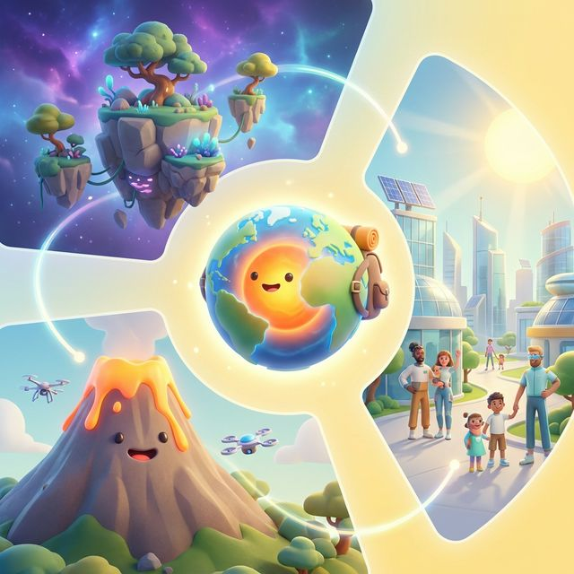

# 小红书爆款笔记策划：地上地下的神奇——地球系列

## 📸 封面设计方案

- **主视觉**：使用 3D 创意地球插图（包含悬浮岛、岩浆火山、永恒白昼城景象）。
- **文字大字报**：
  - **主标题**：如果地球没有引力？🌍 这份“脑洞清单”把我看呆了...
  - **副标题**：家长必存！14个让孩子尖叫的科学奇想 🚀

---

## 📝 笔记文案 (Caption)

**标题：救命！孩子问“能不能挖个洞去美国”，我竟然答不上来...🤯**

各位宝妈宝爸！快收起那些枯燥的百科全书吧！📚
最近挖到了这套《地上地下的神奇——地球》系列，简直是科学教育界的“天花板”！✨

现在的孩子脑洞真的比黑洞还大，他们会问：
❓ “妈妈，要是地球转得飞快，我们会飞出去吗？”
❓ “要是星星不再眨眼了，天上的秘密还在吗？”
❓ “我想在南极站一整天，影子会消失吗？”

别再说“别瞎想了”，这套交互视觉大片直接把这些“科幻场景”变成了现实！每一幕都美到窒息，交互设计更是丝滑得想尖叫！🔥

---

### 🌟 必看的 14 个“脑洞大开”主题：

1. **《没有了地心引力》**：看桌子椅子甚至海洋如何飞向深空，感受力的平衡！🌌
2. **《挖个洞去美国》**：穿透地壳、地幔到地核，这是一场真实的“地心历险记”！🧨
3. **《只有白昼，没有黑夜》**：如果太阳永不落幕，生活会变成什么样？☀️
4. **《快速旋转的地球》**：挑战离心力的极限，看大地如何被“甩”出美感！🌀
5. **《珠穆朗玛峰的视角》**：站在世界之巅，俯瞰大气层的奇迹层叠！🏔️
6. **《地震逃生模拟》**：在 3D 模拟中学习最科学的自救姿势。
7. **《冰川融化之后》**：直观感受全球变暖对海岸线的真实改变。
8. **《光滑的地球外壳》**：如果地球没有了山脉，大气环流会发生什么奇迹？
9. **《站在两极的一天》**：体验极点视角下的时空扭曲感。
10. **《不再闪烁的星星》**：探索大气层外的真实星空。
11. **《火山爆发的真相》**：近距离观察岩浆涌动带来的生命力。
12. **《大海淹没了陆地》**：末日倒影下的环保反思。
13. **《环球旅行日记》**：用科学的眼光丈量地球的半径。
14. **《四季消失的地球》**：如果没有倾斜角，花朵还会开放吗？

---

### 💡 为什么这套内容值得收藏？

✅ **3D 沉浸式交互**：不再是死记硬背！通过 Three.js 打造的 3D 场景，孩子点一点、拖一拖，原理瞬间秒懂！
✅ **OPODS 认知闭环**：观察 🔍 -> 预测 🧠 -> 操作 交互 -> 发现 💡 -> 总结 🎓，逻辑环环相扣！
✅ **审美在线**：高级饱和度配色 + 电影感光影，给孩子最好的美育启蒙。美术、科学双丰收！🎨

**赶紧给家里的“小小科学家”存下来吧！👇**
与其刷短视频，不如带孩子在屏幕上“环绕地球旅行”一圈！

如果你能改变地球的一个物理规则，你最想改哪个？评论区见！💬

---

## #️⃣ 话题标签 (Hashtags)
#科普 #沉浸式教育 #科学启梦 #地球奥秘 #小红书家长会 #有趣知识 #我的私人图书馆 #3D交互 #STEM教育 #带娃必看知识点 #科学教育 #儿童科普
